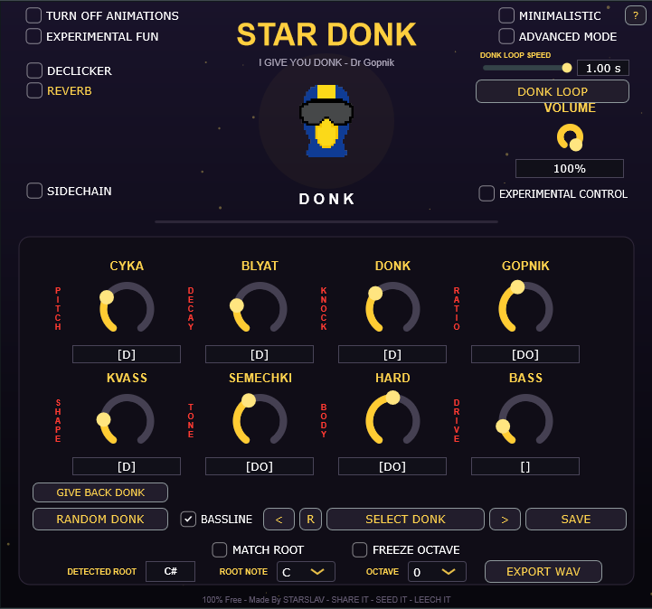
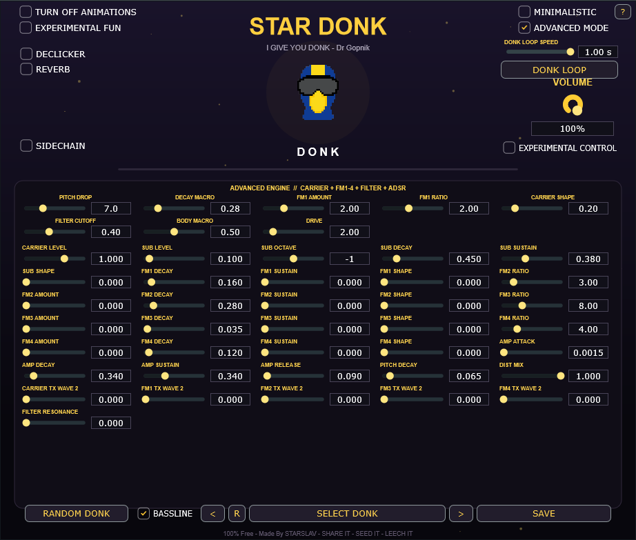
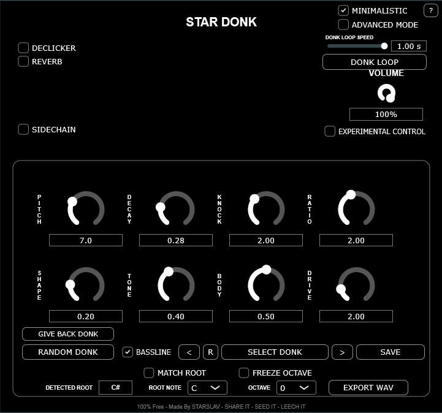
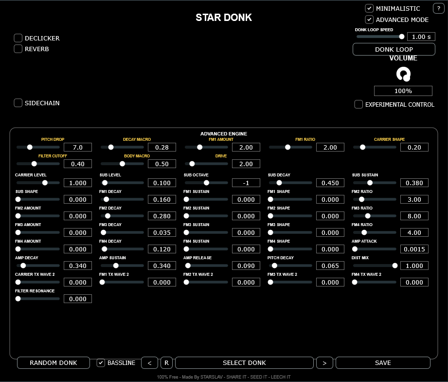
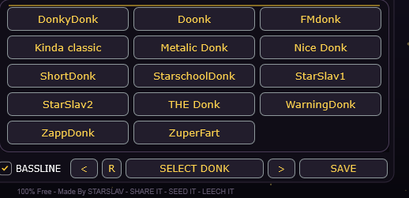

# StarDonk

Free Windows VST3 hardbass / donk synthesizer made by StarSlav.

## Download

**[Download the latest StarDonk release](https://github.com/starslavhardbass/StarDonk/releases/latest)**

Windows 64-bit VST3.

## Demo

[Watch StarDonk in action on YouTube](YOUR_YOUTUBE_VIDEO_URL)

## Features

- Classic donk / hardbass sound
- 8 main macro controls
- Advanced FM engine
- Random donk generator
- Reverb
- Sidechain / ducking
- Declicker
- Preset browser
- Minimalistic mode
- Experimental controls
- Custom face images

## Advanced Mode

Advanced Mode opens the deeper synth engine with FM operators, envelopes,
sub controls, filter resonance, distortion mix and more.

## Minimalistic Mode

A clean black-and-white interface with raw parameter values.

## Minimalistic + Advanced

Advanced controls can also be used together with Minimalistic Mode.

## Presets

StarDonk supports `.donk` presets and preset folders.

## Requirements

- Windows 64-bit
- VST3-compatible DAW

## Installation

Place `StarDonk.vst3` in:

`C:\Program Files\Common Files\VST3`

Place presets in:

`Documents\StarDonk\Presets`

You can create folders inside the preset directory and sort your donks however you want.

## Building from source

StarDonk is written in C++ using JUCE.

You will need JUCE and Visual Studio.

Open `StarDonk.jucer`, generate the Visual Studio project, and build the VST3 target using:

`Release x64`

## License

StarDonk may be modified and redistributed free of charge.

Selling StarDonk or modified versions is not permitted.

Credit to StarSlav is appreciated, but not required.

See `LICENSE` for the full terms.

## StarSlav

YouTube: https://youtube.com/@starslav

Instagram: https://instagram.com/starslavhardbass
